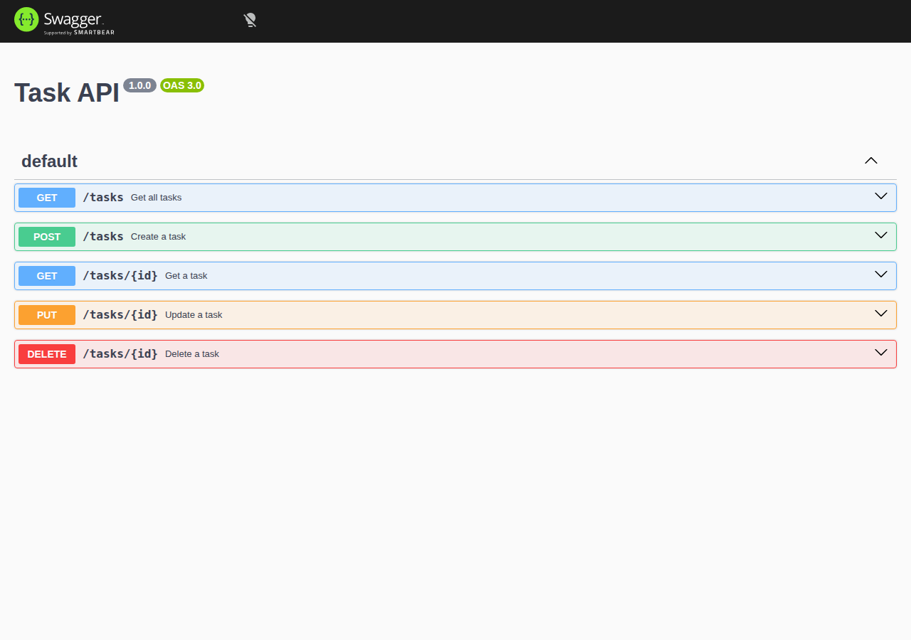

# Task API

A simple in-memory CRUD API for managing tasks, built with Express and TypeScript. This was my first assignment as a Backend AI Engineering intern at FlyRank — the goal was to build a minimal REST API, document it with Swagger, and write clear setup instructions.

The server keeps tasks in a plain in-memory array (no database), and exposes standard Create / Read / Update / Delete endpoints for them. It also serves interactive API docs at `/docs` via Swagger UI.

## Install & Run

```bash
npm install && npm run dev
```

This installs all dependencies and starts the dev server (via `tsx`) on **http://localhost:3000**.

## Endpoints

| Method | Path          | Description                     |
|--------|---------------|----------------------------------|
| GET    | `/`           | API info (name, version, endpoints) |
| GET    | `/health`     | Health check                    |
| GET    | `/tasks`      | Get all tasks                   |
| GET    | `/tasks/:id`  | Get a single task by ID         |
| POST   | `/tasks`      | Create a new task (body: `{ "title": string }`) |
| PUT    | `/tasks/:id`  | Update a task (body: `{ "title": string, "done": boolean }`) |
| DELETE | `/tasks/:id`  | Delete a task by ID             |
| GET    | `/docs`       | Swagger UI (interactive API docs) |

## Example Request

```
$ curl -i http://localhost:3000/tasks

HTTP/1.1 200 OK
X-Powered-By: Express
Content-Type: application/json; charset=utf-8
Content-Length: 117
ETag: W/"75-7hvHNFe4C9UBIYQ/i1+IZv+x3FE"
Date: Sat, 18 Jul 2026 12:36:39 GMT
Connection: keep-alive
Keep-Alive: timeout=5

[{"id":1,"title":"Task 1","done":false},{"id":2,"title":"Task 2","done":true},{"id":3,"title":"Task 3","done":false}]
```

## Swagger UI

Once the server is running, visit `http://localhost:3000/docs` to try out the endpoints interactively.



## The Mortality Experiment

When I added new tasks and restarted the server, GET /tasks returned only the original 3 tasks — my additions were gone. This happens because the task list lives only in RAM (the server process's working memory) as a JavaScript array, and RAM is volatile — its contents are wiped the moment the process stops, so nothing survives a restart unless it's written to persistent storage like a disk or database.

## Pagination

Returning the entire dataset on every request doesn't scale — a table with millions of rows would produce a massive, slow response that no client could realistically render or a user could scroll through anyway. Pagination lets clients ask for a small slice at a time (limit/offset), keeping response times fast and memory usage predictable no matter how large the dataset gets.

## AI vs Me
 
**My prompt:** I didn't write the prompt from scratch — I gave the AI context on what the API needed to do, and asked it to help me turn that into a good prompt (something I picked up from Anthropic's prompting course: AI is generally good at writing prompts for itself). Since the task itself was small, one prompt was enough for the AI to generate a full working solution.
 
**Did it run first try?**
No. The first run failed with a package-related error. On the second attempt, after fixing the dependencies, it ran cleanly and passed all the Stage 4 checkpoint curls.
 
**What did the AI do better — and do I understand it?**
The AI's version was more complete than mine. I understand most of what it wrote, but there are a few extra things in its code I didn't fully follow — pieces that went beyond what I would have written myself, and beyond what I'd have thought to ask for.
 
**What did it get wrong or quietly add?**
Nothing broke functionally — all tasks passed — but the AI added a few extra pieces of logic/structure on its own that I hadn't specified and don't fully understand yet. That's the part I still need to dig into rather than just accept.
 
**What did my prompt forget to specify?**
Because the prompt was AI-assisted and the task was simple, I didn't have to think hard about edge cases myself — which is exactly the gap: I let the AI decide things (like the "extra" logic above) that I never explicitly asked for, instead of specifying them myself.